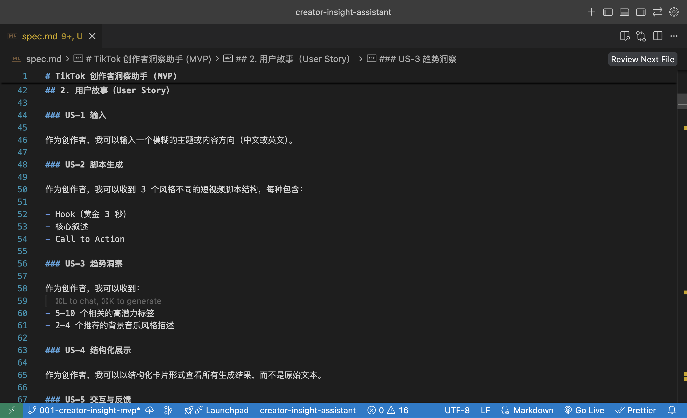
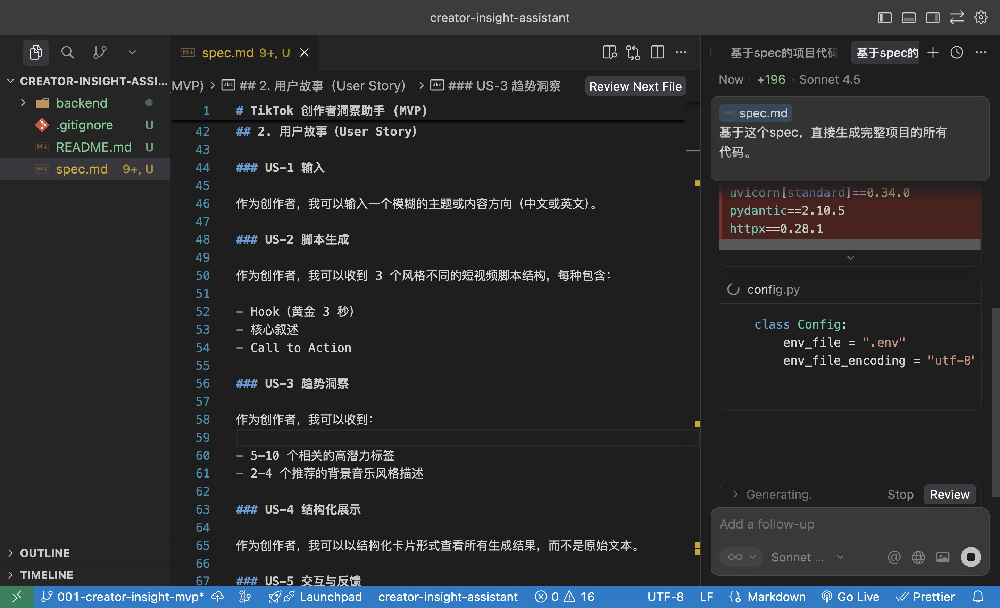
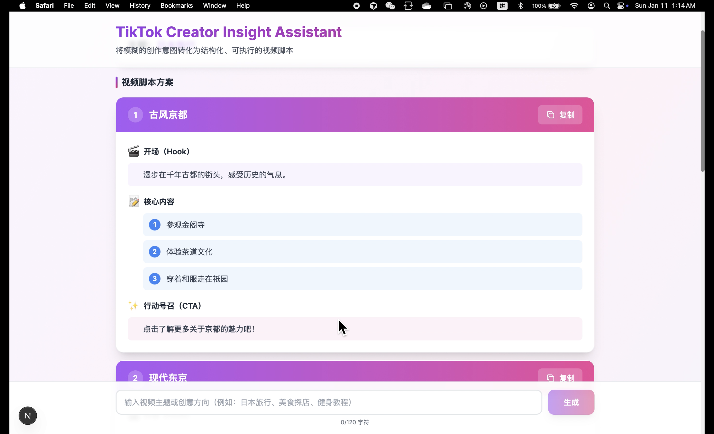

# TikTok Creator Insight Assistant (MVP)

将模糊的创作意图转化为结构化、可执行的视频脚本，提供符合趋势的标签和背景音乐指导。

## 交付物清单

本项目包含以下完整交付物，符合 Spec-Driven Development 开发范式要求：

| 交付物 | 文件 |
|--------|------|
| **A. 技术规格说明书** | [`spec.md`](spec.md) |
| **B. 源代码** | `backend/` + `frontend/` |
| **C. 开发复盘报告** | [`process.md`](process.md) |
| **D. 运行证据** | [查看运行演示](#运行演示)|

## 功能特性

- 🎯 **智能脚本生成**：输入主题，自动生成 3 个不同风格的视频脚本
- 📊 **趋势洞察**：推荐 5-10 个高潜力标签和 2-4 个音乐风格
- 🌐 **多语言支持**：支持中文和英文输入
- 🎨 **现代化 UI**：基于 Tailwind CSS 的精美界面
- 📋 **一键复制**：快速复制脚本和趋势内容

## 技术栈

### 前端
- **Next.js 16** (App Router)
- **React 19**
- **TypeScript**
- **Tailwind CSS**

### 后端
- **FastAPI**
- **Python 3.10+**
- **阿里云百炼 LLM** (Qwen-Max / DeepSeek-V3)
- **Pydantic**

## 项目结构

```
creator-insight-assistant/
├── frontend/                    # Next.js 前端
│   ├── app/                     # Next.js App Router
│   │   ├── layout.tsx          # 根布局
│   │   ├── page.tsx            # 主页面
│   │   └── globals.css         # 全局样式
│   ├── components/              # React 组件
│   │   ├── main-app.tsx        # 主应用组件
│   │   ├── composer-bar.tsx    # 输入栏
│   │   ├── results-pane.tsx    # 结果展示区
│   │   ├── script-card.tsx     # 脚本卡片
│   │   ├── trend-card.tsx      # 趋势卡片
│   │   ├── copy-button.tsx     # 复制按钮
│   │   └── status-card.tsx     # 状态卡片
│   ├── lib/                     # 工具函数
│   │   ├── api-client.ts       # API 客户端
│   │   └── utils.ts            # 通用工具
│   ├── types/                   # TypeScript 类型
│   │   └── api.ts              # API 类型定义
│   ├── .env.example            # 前端环境变量模板
│   ├── .env.local              # 前端环境变量（本地，不提交）
│   └── package.json
├── backend/                     # FastAPI 后端
│   ├── main.py                 # FastAPI 应用入口
│   ├── models.py               # Pydantic 数据模型
│   ├── llm_client.py           # LLM 客户端
│   ├── requirements.txt        # Python 依赖
│   ├── .env.example            # 后端环境变量模板
│   └── .env                    # 后端环境变量（本地，不提交）
├── setup.sh                     # macOS/Linux 配置脚本
├── setup.bat                    # Windows 配置脚本
├── start.sh                     # macOS/Linux 启动脚本
├── start.bat                    # Windows 启动脚本
├── .gitignore
└── README.md
```

## 快速开始

### 前置要求

- **uv**（可选）

### 方法一：使用自动配置脚本（推荐）

这是最简单快速的启动方式，脚本会自动完成所有配置和依赖安装。

#### 1. 克隆项目

```bash
git clone <repository-url>
cd creator-insight-assistant
```

#### 2. 运行配置脚本

**macOS / Linux:**

```bash
# 赋予脚本执行权限
chmod +x setup.sh

# 运行配置脚本
./setup.sh
```

**Windows:**

```cmd
# 在 CMD 或 PowerShell 中运行
setup.bat
```

脚本会自动：
- ✅ 检查 Node.js 和 Python 环境
- ✅ 提示您输入阿里云百炼 API Key
- ✅ 创建并配置环境变量文件
- ✅ 创建 Python 虚拟环境（优先使用 uv，如果可用）
- ✅ 安装所有后端依赖
- ✅ 安装所有前端依赖

#### 3. 启动服务

配置完成后，使用启动脚本：

**macOS / Linux:**

```bash
# 赋予脚本执行权限
chmod +x start.sh

# 启动前后端服务
./start.sh
```

**Windows:**

```cmd
# 在 CMD 或 PowerShell 中运行
start.bat
```

**启动脚本功能：**
- 🚀 自动启动后端服务（端口 8000）
- 🚀 自动启动前端服务（端口 3000）
- 📊 显示服务状态和访问地址

#### 4. 访问应用

服务启动后，在浏览器中访问：
- **前端应用**: http://localhost:3000
- **后端 API**: http://localhost:8000
- **API 文档**: http://localhost:8000/docs

#### 5. 停止服务

**macOS / Linux:**
- 按 `Ctrl+C` 停止所有服务

**Windows:**
- 关闭后端和前端的命令行窗口
- 或在各窗口中按 `Ctrl+C`

---

### 方法二：手动启动

#### 1. 克隆项目

```bash
git clone <repository-url>
cd creator-insight-assistant
```

#### 2. 配置后端环境变量

```bash
# 进入后端目录
cd backend

# 复制环境变量模板
cp .env.example .env

# 编辑 .env 文件，填入您的 API Key
# 使用任意文本编辑器打开 backend/.env
```

编辑 `backend/.env` 文件内容：

```env
ALIBABA_API_KEY=your_actual_api_key_here
ALIBABA_API_ENDPOINT=https://dashscope.aliyuncs.com/compatible-mode/v1
```


#### 3. 配置前端环境变量

```bash
# 返回项目根目录
# 进入前端目录
cd frontend

# 复制环境变量模板
cp .env.example .env.local
```

`frontend/.env.local` 文件内容（通常不需要修改）：

```env
NEXT_PUBLIC_BACKEND_URL=http://localhost:8000
```

#### 4. 安装并启动后端

**选项 A：使用 uv（推荐，速度更快）**

```bash
# 进入后端目录
cd backend

# 使用 uv 创建虚拟环境
uv venv

# 激活虚拟环境
source venv/bin/activate  # macOS/Linux
# 或
venv\Scripts\activate     # Windows

# 使用 uv 安装依赖
uv pip install -r requirements.txt

# 启动后端服务
python main.py
```

**选项 B：使用标准 pip**

```bash
# 进入后端目录
cd backend

# 创建虚拟环境
python3 -m venv venv

# 激活虚拟环境
source venv/bin/activate  # macOS/Linux
# 或
venv\Scripts\activate     # Windows

# 升级 pip
pip install --upgrade pip

# 安装依赖
pip install -r requirements.txt

# 启动后端服务
python main.py
```

后端服务启动后，您会看到：

```
INFO:     Started server process [xxxxx]
INFO:     Waiting for application startup.
INFO:     Application startup complete.
INFO:     Uvicorn running on http://0.0.0.0:8000 (Press CTRL+C to quit)
```

后端现在运行在 `http://localhost:8000`

#### 5. 安装并启动前端

**打开新的终端窗口**，然后：

```bash
# 进入项目目录
cd creator-insight-assistant

# 进入前端目录
cd frontend

# 安装依赖
npm install

# 启动开发服务器
npm run dev
```

前端服务启动后，您会看到：

```
  ▲ Next.js 16.x.x
  - Local:        http://localhost:3000
  - Network:      http://192.168.x.x:3000

 ✓ Ready in 2.5s
```

✅ 前端现在运行在 `http://localhost:3000`

#### 6. 访问应用

在浏览器中打开以下地址：

- **主应用**: http://localhost:3000
- **后端 API 文档**: http://localhost:8000/docs
- **后端健康检查**: http://localhost:8000/

#### 7. 停止服务

在各自的终端窗口中按 `Ctrl+C` 停止服务

---

## 运行演示

### 📋 必需的运行证据（Proof of Work）

根据笔试要求，必须提供以下三类截图：

#### 1. Spec 编写界面截图 📝



---

#### 2. AI 工具生成代码过程截图 🤖



*展示使用 Cursor/Claude 等 AI 工具根据 Spec 生成代码的过程*

---

#### 3. Web App 成功运行截图 ✅



---

### 📹 演示视频


https://github.com/user-attachments/assets/027ae78a-12c7-429e-b909-d3313648a010


---

## 开发规范

本项目严格遵循 Spec-Driven Development：

- 所有实现都基于 `spec.md` 规范
- 数据契约和 API 行为与规范保持一致
- UI 结构和错误处理遵循规范定义

## 许可证

MIT
